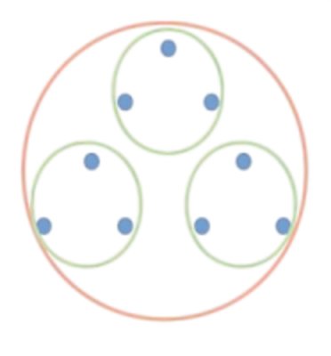

# 🐰 Confederal Republic \<CR>

<figure><figcaption>
Trinity of Trinities
</figcaption></figure>

## :: Confederal Republic \<CR> ::

### I. Root Principles

&#x20;   **(a) Unalienable Rights**

1. _**Life = Social Contract**_
2. _**Liberty = Harm Principle**_
3. _**Pursuit of Happiness = Free Markets**_

&#x20;   **(b) Trinity Separation of Powers**

1. _**Executive**_&#x20;
2. _**Judicial**_
3. _**Legislative**_

&#x20;   **(c) Trinity Confederal Structure**

1. _**Parish**_
2. _**State**_
3. _**Federal**_&#x20;

### II. Presidential versus Parliamentary; Bicameral Legislature • Senate & House

### III. Confederal Equal Protection Law: No Discrimination by Race, Ethnicity, Religion, Gender, Sexual Identity

### IV. **Judicial Legislative Review - Establishing legislation requires passing a judicial legislative review**

### V. Trinity Confederal Powers  &#x20;

#### &#x20;   (a) Parish Powers:

1. _**Primary Taxation Authority**_
   * **$12.5 trillion 2020 total AGI**, in <**USA**>
   * $250 billion 2020 AGI per State, 50 States
   * **13.26%** average 2020 tax rate
   * **$33.15 billion** 2020 tax revenue per State
   * We'll go with **11.1%** **Parish** AGI **tax** **rate**
   * **$27.75 billion** 2025 **Parish** tax revenue, per State.
   * **$1.39 trillion** <mark style="color:green;">**TOTAL**</mark> 2025 Tax Revenue throughout **USA Confederal Republic**
   * <mark style="color:red;">**$18.6 billion**</mark> 2025 <mark style="color:red;">Parish</mark> tax revenue, 2/3rds revenue **retained** by each **Parish**, per State.
   * _<mark style="color:yellow;">**`$9.16 billion`**</mark>_ 2025 <mark style="color:yellow;">**State**</mark> Dues, 1/3rd dues to the State, per State
   * **$3.02 billion** 2025 **Confederal** Dues, 1/3rd State Dues to **USA Confederal Republic**, per State
   * _<mark style="color:purple;">**`$157 billion`**</mark>_ 2025 <mark style="color:green;">**TOTAL**</mark>**  **<mark style="color:purple;">**USA Confederal Republic Dues**</mark>.
   * <mark style="color:green;">**Summary: $1.6 trillion TOTAL Tax Revenues**</mark>
     * **$966 billion = **<mark style="color:orange;">**52 States X**</mark>** **<mark style="color:red;">**$18.6 billion**</mark> **2025** <mark style="color:red;">**Parish**</mark> tax revenue
     * **$476 billion = 52 States X $9.16 billion 2025 State Dues.**&#x20;
     * _<mark style="color:purple;">**`$157 billion`**</mark>_ 2025 <mark style="color:green;">**TOTAL**</mark>**  **<mark style="color:purple;">**USA Confederal Republic Dues**</mark>.
2. _**Social Contract**_
   * _**2.5% Zakat Tax on wealth.** Total tax is 13.5% tax._
3. _**Economic Development**_
   * _Consumption tax is reinvested into Development._

#### &#x20;   (b) State Powers:

1. _**Industry and Trade**_
2. _**Education**_
3. _**Environment**_&#x20;

#### &#x20;   (c) Federal Powers:

1. _**Diplomacy**_
2. _**Interstate Commerce**_
3. _**Military**_&#x20;

### VI. Foreign Policy Objective: Spread through intervention&#x20;

#### &#x20;   (a) Humanitarian Just War Theory&#x20;

#### &#x20;   (b) US Declaration of Independence [_\<Life, Liberty, Pursu_](#user-content-fn-1)[^1]it of Happiness>

#### &#x20;   (c) Confederal Republic \<CR>

[^1]: 
